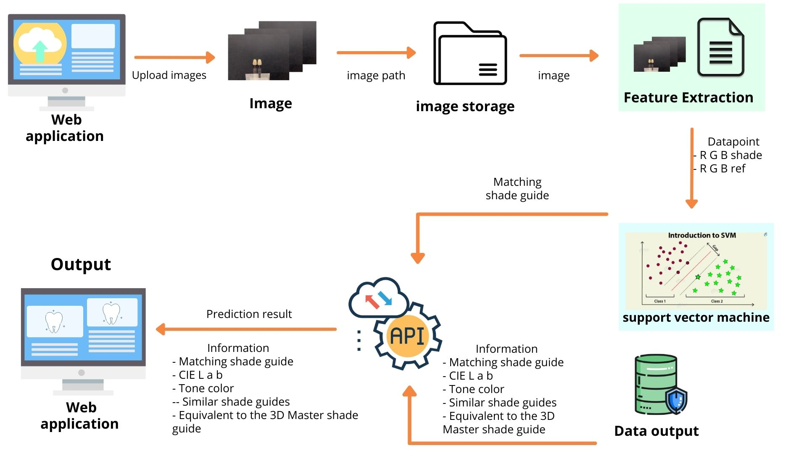

# Matching_Project

This project is Mobile Application for Intelligent Dental Shade Matching.

  

## How to setup API Matching shade guide. 

### 1. Must have anaconda or miniconda.
### 2. Installation
      - conda install pandas
      - python -m pip install pandas
      - pip install flask
      - pip install opencv-python
      - pip install Pillow
      - pip install matplotlib
      - pip install scikit-learn
  
### 3. Create an API according to this order.
      - Create a file named app.py 
      - Upload a model to the predict : [[code]](https://github.com/waraporn19/Matching_Project/blob/main/Model_SVM_C2.pkl)
      
### 4. Use the command to make a file API.py to be able to use.
      - python app.py
      
### 5. Finish
